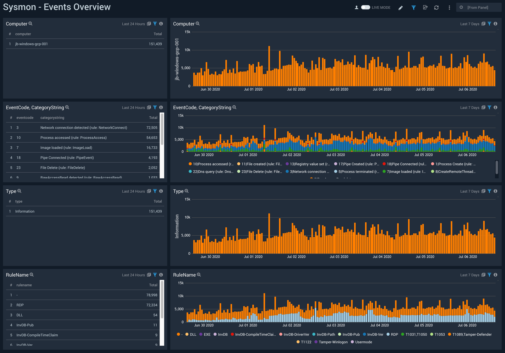
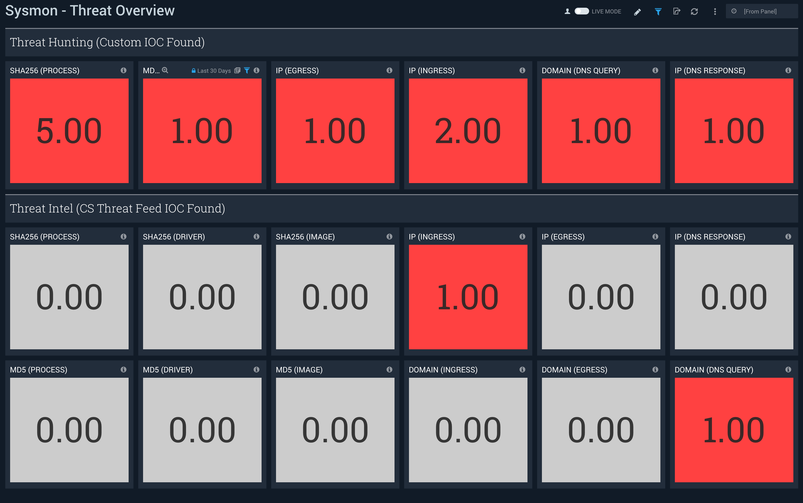
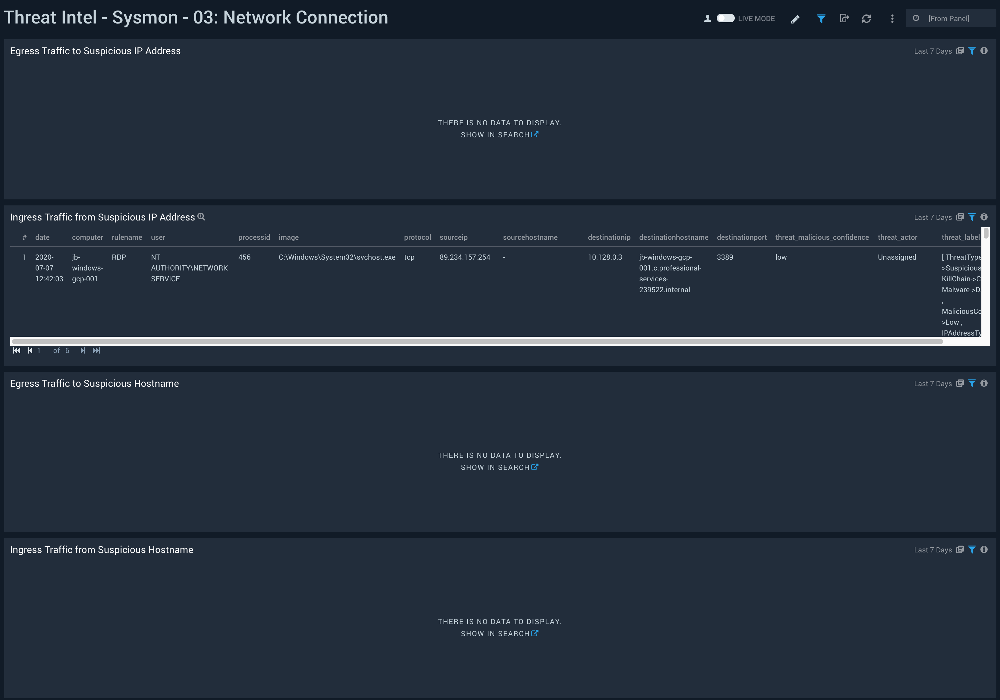
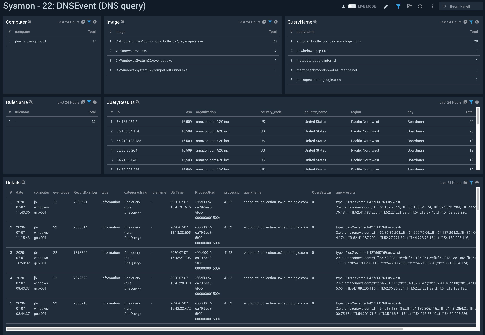
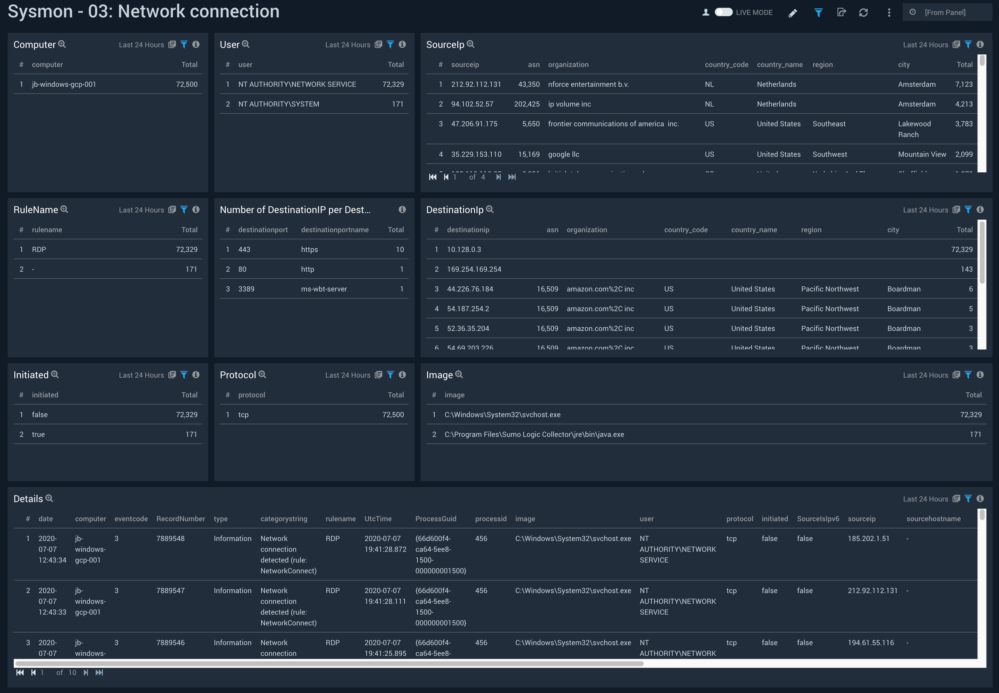

# SYMON

## References
* Sysmon source and documentation: https://docs.microsoft.com/en-us/sysinternals/downloads/sysmon

## Content
The Sysmon package `microsoft-sysmon.json` contains individual queries and dashboards for the following:
* All Sysmon event IDs (1 to 255), including 22 (DNSEvent) and 23 (FileDelete) introduced recently
* Threat Intel correlation (via Crowdstrike Threat Intel feed)
* Threat Hunting (via custom lookup for IP, DOMAIN and file HASH)

All dashboards and queries contain a `pre` and a `post` filter (search parameters):
* `pre` filter can be used to quickly filter events based on the content. This is added to the scope of the search query and will match any string contains anywhere in the event. This field is case insensitive and wildcards can be used.
* `post` filter is added after all parsing (but before the last grouping in dashboard panels), so you can extended the query (for example, using `| where rulename="RDP"`). For individual queries, this can be used to modify the output quickly (for example: `| count as Total Computer`).

### Content tree:
* Dashboards
    * Activity
        * Sysmon - Events Overview
        * Sysmon - Investigation Dashboard
        * Sysmon - Threat Overview
    * Individual Events
        * Sysmon - 01: Process creation
        * Sysmon - 02: A process changed a file creation time
        * Sysmon - 03: Network connection
        * Sysmon - 04: Sysmon service state changed
        * Sysmon - 05: Process terminated
        * Sysmon - 06: Driver loaded
        * Sysmon - 07: Image loaded
        * Sysmon - 08: CreateRemoteThread
        * Sysmon - 09: RawAccessRead
        * Sysmon - 10: ProcessAccess
        * Sysmon - 11: FileCreate
        * Sysmon - 12: RegistryEvent (Object create and delete)
        * Sysmon - 13: RegistryEvent (Value Set)
        * Sysmon - 14: RegistryEvent (Key and Value Rename)
        * Sysmon - 15: FileCreateStreamHash
        * Sysmon - 16: Sysmon configuration change
        * Sysmon - 17: PipeEvent (Pipe Created)
        * Sysmon - 18: PipeEvent (Pipe Connected)
        * Sysmon - 19: WmiEvent (WmiEventFilter activity detected)
        * Sysmon - 20: WmiEvent (WmiEventConsumer activity detected)
        * Sysmon - 21: WmiEvent (WmiEventConsumerToFilter activity detected)
        * Sysmon - 22: DNSEvent (DNS query)
        * Sysmon - 23: FileDelete (A file delete was detected)
        * Sysmon - 255: Error
    * Operations
        * Sysmon - Service Overview
    * Queries
        * Global Search
            * Sysmon - All Events (All Fields Extracted)
        * Individual Events
            * Sysmon - 01: Process creation
            * Sysmon - 02: A process changed a file creation time
            * Sysmon - 03: Network connection
            * Sysmon - 04: Sysmon service state changed
            * Sysmon - 05: Process terminated
            * Sysmon - 06: Driver loaded
            * Sysmon - 07: Image loaded
            * Sysmon - 08: CreateRemoteThread
            * Sysmon - 09: RawAccessRead
            * Sysmon - 10: ProcessAccess
            * Sysmon - 11: FileCreate
            * Sysmon - 12: RegistryEvent (Object create and delete)
            * Sysmon - 13: RegistryEvent (Value Set)
            * Sysmon - 14: RegistryEvent (Key and Value Rename)
            * Sysmon - 15: FileCreateStreamHash
            * Sysmon - 16: Sysmon configuration change
            * Sysmon - 17: PipeEvent (Pipe Created)
            * Sysmon - 18: PipeEvent (Pipe Connected)
            * Sysmon - 19: WmiEvent (WmiEventFilter activity detected)
            * Sysmon - 20: WmiEvent (WmiEventConsumer activity detected)
            * Sysmon - 21: WmiEvent (WmiEventConsumerToFilter activity detected)
            * Sysmon - 22: DNSEvent (DNS query)
            * Sysmon - 23: FileDelete (A file delete was detected)
            * Sysmon - 255: Error
    * Threat Hunting
        * IOC Management
            * 1- Create IOCS lookup (shared/threat_hunting/iocs)
            * 2- Add new entry in IOCS lookup (shared/threat_hunting/iocs)
            * 3- List content of IOCS lookup (shared/threat_hunting/iocs)
        * Threat Hunting - Sysmon - 01: Process Creation
        * Threat Hunting - Sysmon - 03: Network Connection
        * Threat Hunting - Sysmon - 03: Network Connection
    * Threat Intelligence
        * Threat Intel - Sysmon - 01: Process Creation
        * Threat Intel - Sysmon - 03: Network Connection
        * Threat Intel - Sysmon - 06: Driver loaded
        * Threat Intel - Sysmon - 07: Image loaded
        * Threat Intel - Sysmon - 22: DNSEvent (DNS query)

## Installation
1. Download `microsoft-sysmon.json`
2. Using a text editor, search for the string `**TO_REPLACE**` and replace with the source category for Sysmon data (for example: `prod/windows/*`).
3. Before importing content, you need to create the IOC lookup by running the following command:
```* | limit 1
| "127.0.0.1" as ioc
// ioc_type: IP, DOMAIN, SHA256, MD5
// DOMAIN entries should be in lowercase
// SHA265 and MD5 can be in lowercase or uppercase (but not both)
| "IP" as ioc_type
| "Custom" as ioc_source
| "This is a for testing only" as ioc_description
| count ioc, ioc_type, ioc_source, ioc_description
| fields -_count
| save shared/threat_hunting/iocs
```
4. Import content in Sumologic library
5. Enjoy!

### Threat Hunting
In order to use the custom Threat Hunting dashboard, IOCs must be added into the lookup `shared/threat_hunting/iocs`.
IOC type must be: `IP`, `DOMAIN`, `SHA256` or `MD5`.

1. To create the lookup for the first IOC, open the query called `1- Create IOCS lookup (shared/threat_hunting/iocs)`.
2. To add a new entry into that lookup, open the query called `2- Add new entry in IOCS lookup (shared/threat_hunting/iocs)`
3. To list the content of the lookup, open the query called `3- List content of IOCS lookup (shared/threat_hunting/iocs)`

### Screenshots











